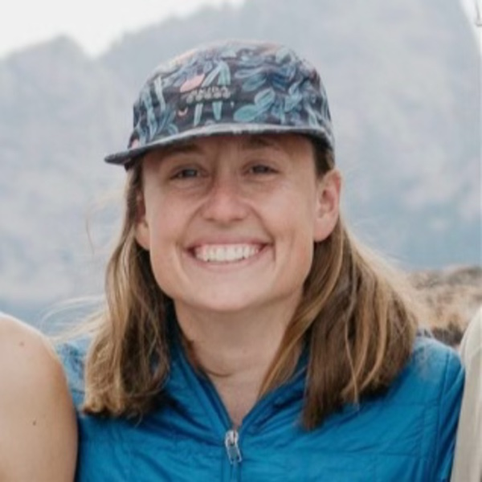

We are delighted to welcome **Ellen Davenport** to the group as a postdoctoral researcher, starting 1 October 2026.

---

## Background

Ellen completed a PhD in oceanography at **Scripps Institution of Oceanography**, UC San Diego, this summer, working with **Bruce Cornuelle**, **Matthew Mazloff** and **Ariane Verdy** on ocean state estimation in the tropical Pacific. The dissertation — *Data Assimilation in Nonlinear Systems: Autonomous Navigation, Equatorial Ocean Dynamics, and Differentiable Earth System Modeling* — ranges across three settings that share a single mathematical core: how to constrain a nonlinear model with sparse, indirect observations.

Much of that work used the Tropical Pacific Ocean State Estimate (TPOSE), a regional MITgcm configuration fitted to moorings, Argo floats and satellite data by the adjoint method. A recent [first-author paper](https://doi.org/10.1029/2026JC024381) in *Journal of Geophysical Research: Oceans* uses it to ask what the vertical momentum flux at 0°N, 140°W is missing — showing that internal waves unresolved by the model matter for the sea surface temperature of the equatorial cold tongue. Ellen has also contributed to **JCM**, a differentiable intermediate-complexity atmospheric model written to make gradient-based learning and assimilation possible inside an Earth system model rather than bolted onto it.

The route to that PhD ran through industry. After an engineering degree at **Dartmouth College** and a co-op at Physical Sciences Inc., Ellen spent four years as an embedded software engineer at **Sarcos Robotics** before returning to graduate school, earning an MS in Electrical and Computer Engineering at UC San Diego in 2023 along the way. That background shows in the work: a strong practical streak in scientific software, and an instructor's interest in passing it on — through Software Carpentry and the Python for Earth Science course at Scripps.

## Research in the group

Ellen joins the [**SAFARI** project](/projects/) (Sea Air Flux and Atmospheric River Initiative), supported by the Office of Naval Research, and will use machine learning and AI tools to improve our understanding of how the ocean contributes to the development of atmospheric rivers over the North Pacific.

The question sits squarely at the intersection SAFARI was built to address. Atmospheric rivers draw their moisture and much of their intensity from the ocean beneath them, yet the air-sea exchange that supplies them is among the least well constrained parts of a forecast. Bringing data-driven methods to bear on it means asking what the ocean state contributes to the growth of an individual event — a question that needs both the assimilation machinery Ellen brings from the tropical Pacific and models differentiable enough to be learned from.

## Looking ahead

We are glad to have Ellen's combination of oceanography, data assimilation and engineering in the group, and look forward to where the SAFARI work leads. Welcome, Ellen!
