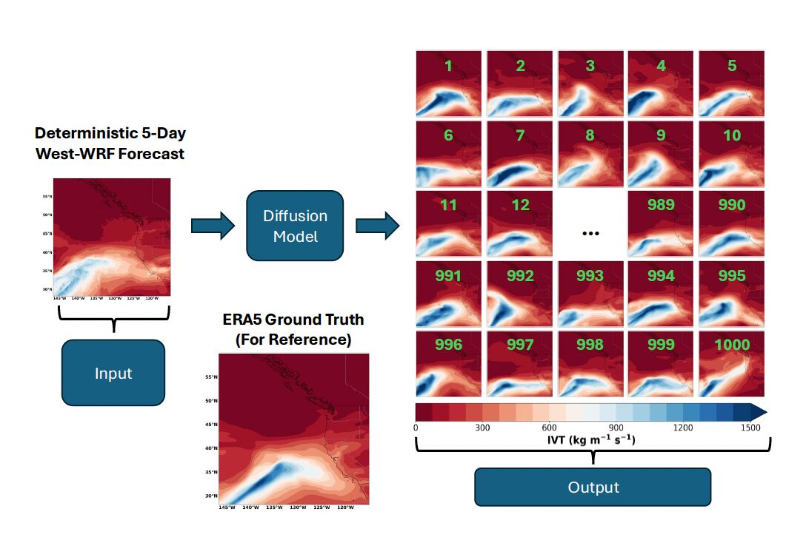

We are delighted to share that a new paper led by **Dr. Timothy B. Higgins** — a former PhD student in the group, now a postdoctoral research associate — has been published in the American Meteorological Society journal *[Artificial Intelligence for the Earth Systems](https://doi.org/10.1175/AIES-D-25-0075.1)*.

---

## Generating a 1,000-Member Ensemble with Diffusion

The paper, **"Generating a 1000-Member Ensemble of Integrated Water Vapor Transport Forecasts with Diffusion,"** tackles a long-standing bottleneck in probabilistic weather prediction: traditional ensemble systems are so computationally expensive that operational centers can only afford to run a small number of perturbed simulations, limiting how well forecasters can characterize the risk of extreme events.

Tim and coauthors instead use **diffusion**, a form of generative AI, to expand a single deterministic forecast from the West Coast-focused West-WRF model into a full **1,000-member ensemble** of integrated water vapor transport (IVT) over the North Pacific — at a fraction of the computational cost of a traditional dynamical ensemble.

Evaluated against binned rank histograms, continuous ranked probability score, spread-to-error ratio, reliability diagrams, and Brier skill scores, the diffusion ensemble **outperforms operational ensembles from both the Global Ensemble Forecast System (GEFS) and the European Centre for Medium-Range Weather Forecasts (ECMWF)**. The authors also show that the ensemble produces realistic, high-quality representations of real extreme events — a promising sign for its use in operational risk assessment.

## A Collaborative Effort

The study was coauthored by **Dr. Timothy B. Higgins**, **William E. Chapman** (NCAR), **Dr. Aneesh Subramanian** (University of Colorado Boulder), and **Dr. Luca Delle Monache** (CW3E / Scripps Institution of Oceanography), building on Tim's dissertation work and his time in the Advanced Study Program at NCAR.

This publication formalizes the diffusion-based approach that already underpins the **operational ensemble forecasting system now live at the Center for Western Weather and Water Extremes (CW3E)** — see our [earlier announcement](/post/higgins-ar-diffusion-forecast-2026/) about that launch.

## View the Live Model Forecasts

**[View the live operational diffusion ensemble forecasts on the CW3E website](https://cw3e.ucsd.edu/ml_forecasts/#Diffusion)**

Congratulations to Tim and the entire team on this well-earned publication!
