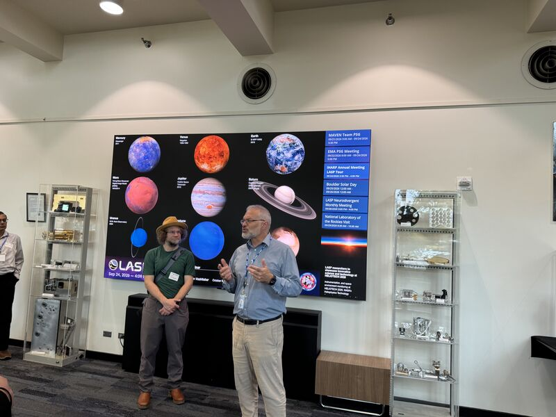
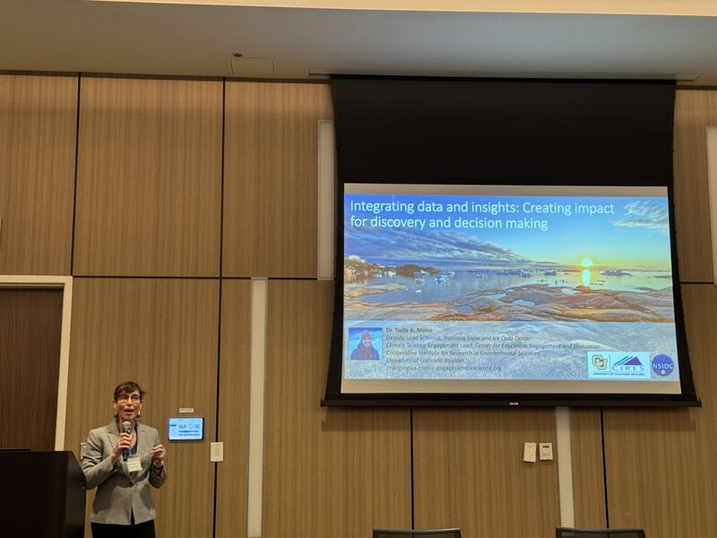
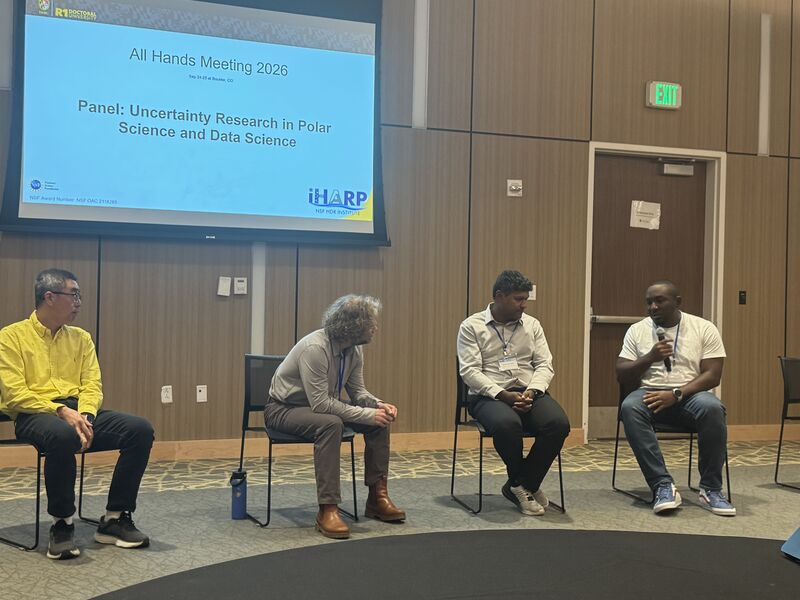

The **Institute for Harnessing Data and Model Revolution in the Polar Regions (iHARP)** held its 2026 All Hands Meeting at **Williams Village** on the University of Colorado Boulder campus on 24–25 September 2026. **Prof. Aneesh Subramanian** hosted the meeting locally, welcoming the institute's researchers, students and collaborators to Boulder for two days of presentations, panels and planning.

iHARP is a National Science Foundation Harnessing the Data Revolution (HDR) institute, directed by **Prof. Vandana Janeja** of the University of Maryland, Baltimore County (UMBC). It brings data science together with polar science to improve understanding of ice sheet dynamics and their contribution to sea-level rise through physics-informed, data-driven discovery. The All Hands Meeting is the institute's annual opportunity to see that work whole — from radar sounding of the bed beneath an ice sheet to the statistical machinery that turns those observations into projections.

## Day one: the institute's work, end to end

Prof. Janeja opened with remarks and a **State of the Institute** address, followed by two blocks of *iHARP Full Cycle Presentations* spanning ice sheet modeling, causal inference, sea-level downscaling, radargram processing, subglacial bed mapping, physics-informed neural networks and glacier trajectory analysis. A midday panel, **Envisioning the Future Frontiers**, brought together **Dr. Beth Plale** (University of Oregon), **Dr. Shashi Shekhar** (University of Minnesota) and **Dr. Shaowen Wang** (University of Illinois Urbana-Champaign). The afternoon turned to software: an **iHARP Toolkit Showcase** presented the PolarIS infrastructure, the Polar Ice Museum, modeling of Antarctic sea ice and ice shelf linkages, an assistant for research validation built on large language models, and the PolarKD knowledge discovery toolkit.

The day closed with a visit to the **Laboratory for Atmospheric and Space Physics (LASP)** at CU Boulder. Our thanks to **Carl J. Gelderloos** and **Chris Koenig** for guiding the tour and for sharing their enthusiasm for the science done there.

## Day two: keynote, panels and new members

**Dr. Twila Moon**, Deputy Lead Scientist at the National Snow and Ice Data Center and Climate Science Engagement Lead at CIRES, delivered the keynote, *Integrating data and insights: Creating impact for discovery and decision making*.

A panel on **Convergence and Translation** followed, with **Dr. Christine Kirkpatrick** (San Diego Supercomputer Center), **Dr. Rachel Brennan** (Colorado State University) and **Dr. Mohamed Mokbel** (University of Minnesota), and the institute heard new member talks from **Lora Harris** and **Maria Molina**.

Prof. Subramanian joined the panel on **Uncertainty Research in Polar Science and Data Science**, moderated by **Dr. Sharad Sharma**, alongside **Dr. Andy Aschwanden** (University of Alaska Fairbanks), **Dr. Tolulope Ale** (Microsoft) and **Dr. Jianwu Wang** (UMBC). Quantifying uncertainty is a shared problem for the two communities iHARP joins: sparse and indirect polar observations, imperfect ice sheet physics, and learned models whose confidence must itself be calibrated before a projection can inform a decision. Breakout discussions on *Envisioning the Next Frontier* closed the meeting.

## Acknowledgements

Our thanks to **Prof. Vandana Janeja** for leading the institute and the meeting, and to the organizing team — **Nikki Monczewski**, **Josephine Namayanja** and **Achala Denagamage** — whose work behind the scenes made the two days run. Thanks also to colleagues at the UMBC Imaging Research Center, and to the **National Science Foundation** for supporting iHARP.

**Meeting programme**: [iHARP All Hands Meeting, September 2026](https://iharp.umbc.edu/all-hands-meeting/sep2026/)

**More about the institute**: [iharp.umbc.edu](https://iharp.umbc.edu/)

**From the director**: [Prof. Vandana Janeja's account of the meeting](https://www.linkedin.com/feed/update/urn:li:activity:7509683924105768961/)
