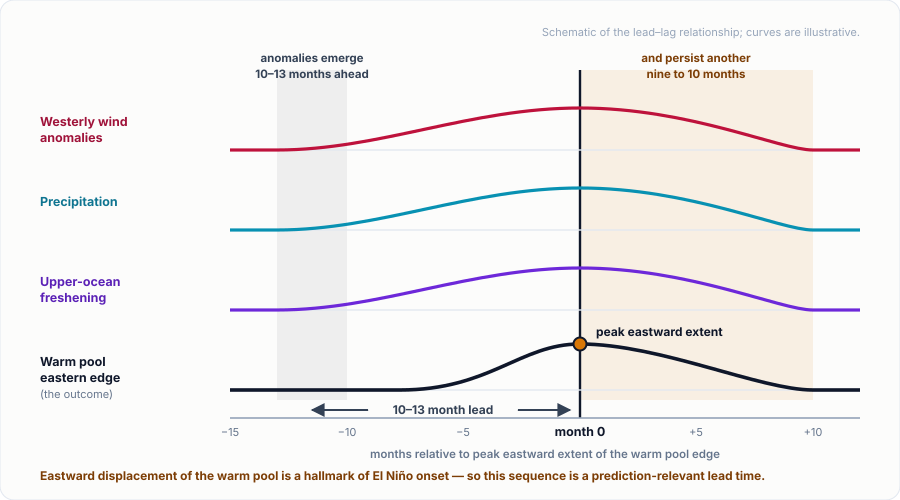

We are delighted to share that a new paper led by **Yuan-Jen Lin** — a postdoctoral researcher in the group, co-mentored by Aneesh Subramanian and Kristopher Karnauskas — has been published in the American Meteorological Society journal *[Journal of Climate](https://doi.org/10.1175/JCLI-D-25-0398.1)*. The study shows that salinity, not temperature alone, sets the structure and variability of the upper equatorial Pacific — with consequences for how well climate models represent the onset of El Niño.

---

## Why Barrier Layers Matter

Heavy rainfall over the western Pacific warm pool leaves a thin, buoyant cap of fresh water at the surface. The mixed layer can then become shallower than the top of the thermocline, and the salinity-stratified water in between forms what oceanographers call a **barrier layer**.

The name describes what it does: the layer suppresses upward entrainment of cold thermocline water, trapping heat and momentum near the surface and so exerting direct control on sea surface temperature and tropical air-sea coupling. The paper, **"Salinity-Driven Barrier Layer Dynamics in the Equatorial Pacific,"** establishes that salinity-induced vertical stratification shapes both the climatology and the variability of the Pacific barrier layer, on subannual and interannual timescales alike.

## A Persistent Bias in Coupled Models

Compared against observations and reanalysis, coupled ocean-atmosphere models place the eastern edge of the warm pool too far west and simulate a barrier layer that is systematically too thin. The authors trace this bias to a single upstream cause: the models keep the upper western Pacific too salty, a consequence of weaker precipitation and stronger easterly winds along the equator. The relationship holds across the ensemble: models that extend the warm pool further east also produce thicker barrier layers and fresher western Pacific water, tying a familiar tropical bias to an ocean salinity error rather than a purely atmospheric one.

One result stands out for prediction. The models reproduce the timing and magnitude of the wind and precipitation anomalies well, but they **fail to reproduce subannual salinity variations** — precisely the quantity that governs barrier layer thickness.

## A Precursor to Warm Pool Expansion

The interannual findings connect the work to El Niño-Southern Oscillation (ENSO) development. Observations, reanalysis and models agree that anomalous westerly winds and increased precipitation appear **10 to 13 months before** the warm pool's eastern edge reaches peak eastward extent, accompanied by upper-ocean freshening; the anomalies peak with the shift and persist a further nine to 10 months. Because eastward displacement of the warm pool is a hallmark of El Niño onset, a salinity signal leading it by roughly a year is a genuinely prediction-relevant lead time.

The tropical Pacific is now offering a test of that sequence. Forecasters at the National Oceanic and Atmospheric Administration (NOAA) announced [the formation of El Niño](https://www.noaa.gov/news-release/el-nino-forms-expected-to-strengthen-say-noaa-forecasters) on 11 June 2026, and the Climate Prediction Center's 10 September discussion puts the probability of a very strong event during Northern Hemisphere fall and winter 2026-27 above 90%, with Niño-3.4 at +1.8 °C and Niño-1+2 at +3.4 °C. The event is strongly east-Pacific in character — the central-Pacific Niño-4 index fell to +0.1 °C in August — a demanding case rather than a textbook one for a precursor rooted in western Pacific freshening. Whether the salinity pathway holds here is an open question, and the models' difficulty with subannual salinity is what stands in the way of using it operationally.

## Observing the Processes Directly: TEPEX

Closing that gap requires observations the present network cannot supply. The **Tropical Pacific Observing System (TPOS) Equatorial Pacific Experiment (TEPEX)**, supported by the NOAA Climate Program Office through its Climate Variability and Predictability (CVP) Program, will mount field campaigns in the tropical Pacific between 2026 and 2028. Its central component, TEPEX-C, targets the coupling of the troposphere with the ocean mixed and barrier layers, and the processes that regulate zonal temperature gradients and generate the surface jets which expand and contract the warm pool — the same processes this paper examines in models.

Prof. Aneesh Subramanian is a principal investigator on a NOAA CVP award under the TEPEX umbrella; the group's tropical Pacific work is listed on our [projects page](/projects/), with further campaign detail from the [NOAA Climate Program Office](https://cpo.noaa.gov/tropical-pacific-observing-system-tpos-equatorial-pacific-experiment-tepex/).

## A Collaborative Effort

The study was coauthored by **Dr. Yuan-Jen Lin** (University of Colorado Boulder), **Dr. Aneesh C. Subramanian** (University of Colorado Boulder), **Dr. Kristopher B. Karnauskas** (University of Colorado Boulder), **Dr. Charlotte A. DeMott** (Colorado State University), **Dr. Janet Sprintall** (Scripps Institution of Oceanography), and **Dr. Rui Sun** (Scripps Institution of Oceanography).

Congratulations to Yuan-Jen and the entire team on this well-earned publication!

**Read the paper**: [Journal of Climate](https://doi.org/10.1175/JCLI-D-25-0398.1) · [publication page](/publication/lin-2026/)
