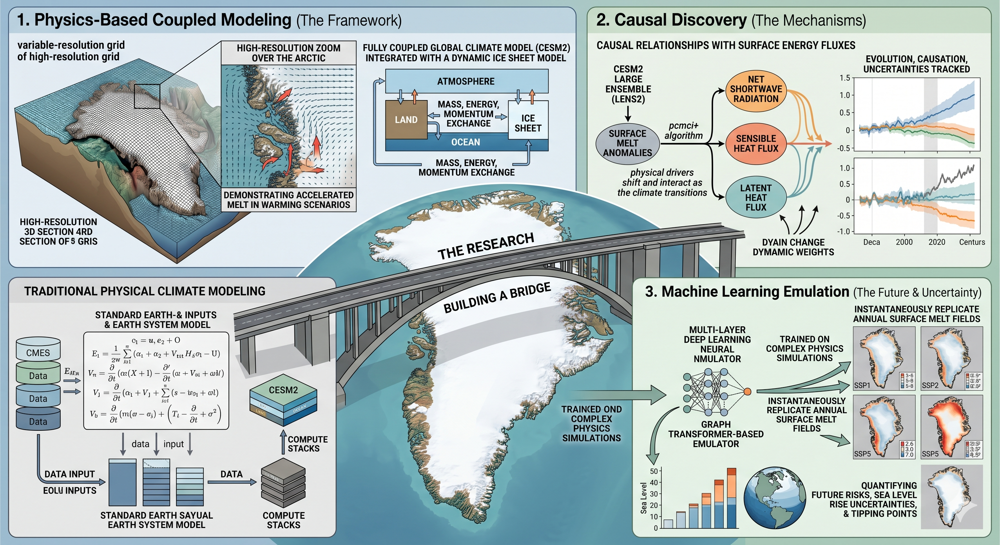

We are incredibly proud to announce that **Ziqi Yin** has successfully defended his PhD dissertation today in the Department of Atmospheric and Oceanic Sciences (ATOC) at the University of Colorado Boulder.

**Dissertation title:** Advancing Understanding of Greenland Ice Sheet Surface Melt Using Physics-Based and Machine Learning Models

**Defense committee:** Dr. Aneesh Subramanian (advisor, CU Boulder), Dr. Alexandra Jahn (CU Boulder), Dr. Rajashree Tri Datta (Delft University of Technology), Dr. Adam Herrington (National Center for Atmospheric Research), and Dr. Jianwu Wang (University of Maryland, Baltimore County).

---

## Research Overview

Ziqi's doctoral work marks a major step forward in polar climate research, bridging advanced physically-coupled Earth system modeling with cutting-edge data science and deep learning. His research focuses on improving our understanding of Greenland Ice Sheet (GrIS) mass loss — specifically surface melt, which has emerged as the dominant contributor to Greenland's ice sheet degradation and subsequent global sea level rise in recent decades.

His dissertation consists of three core research thrusts:

**1. Topographic Resolution Matters in Long-Term Projections**
*(Published in the Journal of Advances in Modeling Earth Systems, JAMES)*

Ziqi investigated how atmospheric grid resolution impacts century-scale ice sheet simulations. Using a variable-resolution (VR) grid featuring a ¼° regional refinement over the Arctic within the fully coupled CESM2.2–CISM2.1 framework, he demonstrated that conventional 1° coarse models flatten Greenland's steep coastal topography. This flattening artifact artificially accelerates the positive melt–albedo feedback. By accurately resolving the terrain, his refined grid projected a multi-century sea level rise contribution (831 mm by year 350) that is 20–40% smaller than traditional models, indicating that coarse-resolution models may be overestimating future sea level rise.

**2. Disentangling Melt Drivers via Causal Discovery**
*(Under review at Geophysical Research Letters)*

Moving beyond traditional correlation metrics, Ziqi applied the PCMCI+ causal discovery algorithm to isolate direct physical causes of summer melt anomalies in the ablation zone. His work successfully identified net shortwave radiation (the melt–albedo feedback) and turbulent heat fluxes (sensible and latent heat) as the dominant contemporaneous drivers of monthly summer melt anomalies. Under late-century high-warming scenarios (SSP3-7.0), he found that turbulent heat links become undirected, indicating a transition toward a more tightly synchronous and intensely coupled surface–atmosphere regime.

**3. Accelerating Climate Projections with Graph Transformers**
*(In preparation for The Cryosphere)*

Ziqi developed a novel machine learning spatial emulator using a hybrid Graph Transformer architecture that combines local message passing with global self-attention. Trained on the 100-member CESM2 Large Ensemble (LENS2), the emulator faithfully replicates complex annual spatial melt fields under various climate conditions with an R² score above 0.99 and a root-mean-square error below 10%. When deployed across available CMIP6 models, it projects a surface melt increase of 89% (under low-emission SSP1-2.6) to 267% (under high-emission SSP5-8.5) by end of century. Under high-emission scenarios, Greenland's northern basins are projected to experience the strongest acceleration in melting and eventually become the largest regional contributors to mass loss.

---

## Impact

By combining the predictive power of variable-resolution climate physics, causal graphs, and spatial machine learning emulators, Ziqi's work provides the scientific community with highly efficient, robust tools to track ice sheet–atmosphere interactions. These frameworks open new pathways for fast uncertainty quantification, risk assessments, and the identification of potential climate tipping points.

Please join us in extending our warmest congratulations to **Dr. Ziqi Yin** on this stellar milestone and wishing him all the best in his future scientific career!
